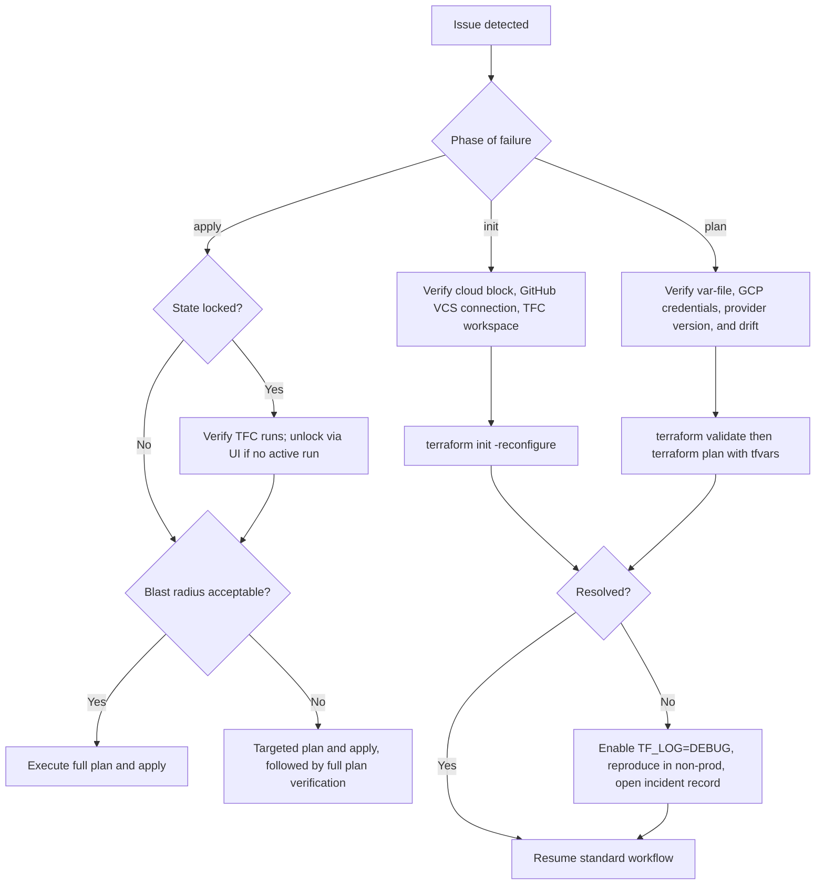

# Terraform Troubleshooting, State Management, and Best Practices

**Document type:** Standard Operating Guideline

## 1. Purpose

This document defines the standard operating guidelines for troubleshooting, state management, and change management for Terraform-managed infrastructure. It supersedes prior per-module migration notes and is intended as the authoritative reference for engineers, reviewers, and incident responders.

## 2. Scope

These guidelines apply to all infrastructure managed under the following stack:

- **Cloud provider:** Google Cloud (GCP)
- **Provisioning tool:** Terraform (>= 1.6.0)
- **Remote backend and run environment:** Terraform Cloud (TFC)
- **Source control:** Private repositories on GitHub, hosted under the organization account

## 3. Audience

- Platform and DevOps engineers
- Site Reliability Engineers (SRE)
- Application engineers contributing to shared Terraform modules
- Reviewers approving infrastructure pull requests

## 4. Guiding Principles

1. All Terraform state must reside in Terraform Cloud. Local state files are prohibited in shared workflows.
2. Every change must be validated in a non-production workspace prior to promotion to production.
3. All infrastructure code changes must be reviewed through a GitHub pull request.
4. Exception operations (`-target`, `-replace`, `force-unlock`) require documented justification.
5. Module and provider versions must be pinned. Floating references (for example `ref=main`) are not permitted.
6. Secrets must not be committed to source control.

---

## 5. State Management

### 5.1 Backend Configuration

State is managed exclusively through Terraform Cloud, with one workspace per environment (for example `network-nonprod`, `network-prod`). Each workspace is connected to the associated private GitHub repository via the Terraform Cloud VCS integration.

The following backend configuration is the standard for all root modules:

```hcl
terraform {
  required_version = ">= 1.6.0"

  required_providers {
    google = {
      source  = "hashicorp/google"
      version = "~> 5.0"
    }
  }

  cloud {
    organization = "our-org"

    workspaces {
      name = "network-prod"
    }
  }
}

provider "google" {
  project = var.gcp_project_id
  region  = var.gcp_region
}
```

Notes:

- The `cloud {}` block is the required backend syntax for new modules. Legacy `backend "remote"` blocks must be migrated at the next scheduled maintenance window.
- GCP authentication must use Terraform Cloud Dynamic Provider Credentials (Workload Identity Federation). Long-lived service account keys must not be stored in workspace variables.

### 5.2 Initialization Commands

| Scenario | Command |
|---|---|
| Fresh clone from GitHub | `terraform init` |
| Backend block was modified | `terraform init -reconfigure` |
| Migrating existing state into TFC | `terraform init -migrate-state` |

### 5.3 State Inspection

State inspection commands are read-only and safe to execute at any time:

```bash
terraform state list
terraform state show google_compute_network.vpc
```

`terraform state list` must be executed prior to any state-modifying operation.

### 5.4 State Modification

#### 5.4.1 Move a Resource Address

Use `terraform state mv` to rename or relocate a resource within state without destroying and recreating the underlying resource:

```bash
terraform state mv \
  'module.network.google_compute_subnetwork.private[0]' \
  'module.network.google_compute_subnetwork.workload[0]'
```

#### 5.4.2 Remove a Resource from State

Use `terraform state rm` to detach a resource from Terraform management while leaving the underlying GCP resource in place:

```bash
terraform state rm module.legacy.google_project_iam_member.old
```

#### 5.4.3 Import an Existing Resource

Use `terraform import` to place an existing GCP resource under Terraform management:

```bash
terraform import google_storage_bucket.logs \
  projects/our-gcp-project/buckets/our-logs-bucket
```

### 5.5 State Modification Requirements

State-modifying operations must:

1. Be executed through a reviewed pull request describing the intent and expected outcome.
2. Be preceded by capture of the current state version identifier from the Terraform Cloud workspace, to support rollback.
3. Prefer `state mv` over destroy-and-recreate for stateful resources (for example Cloud SQL instances, GCS buckets containing data, load balancers with reserved IPs).

### 5.6 Conflict Handling

| Condition | Required Action |
|---|---|
| Stale lock in Terraform Cloud | Verify no active run exists in the TFC runs view, then use the **Unlock** action in the TFC UI. |
| Terraform Cloud UI unavailable | Execute `terraform force-unlock <LOCK_ID>` only after confirming no active run exists. |
| Sequential runs producing unexpected drift | Execute a speculative (plan-only) run to review the delta before applying. |
| Apply interrupted by transient failure | Re-execute the plan and review the output carefully; any `created` or `destroyed` diff must be validated before apply. |

### 5.7 References

- Terraform state overview — https://developer.hashicorp.com/terraform/language/state
- `terraform state` commands — https://developer.hashicorp.com/terraform/cli/commands/state
- Importing resources — https://developer.hashicorp.com/terraform/cli/commands/import
- Terraform Cloud state management — https://developer.hashicorp.com/terraform/cloud-docs/workspaces/state

---

## 6. Targeted Operations

### 6.1 Definition

The `-target` flag restricts a Terraform plan or apply to a specific resource address and its dependencies. Use of `-target` is classified as an exception operation and is restricted to defined scenarios.

### 6.2 Permitted Use Cases

- Production incident remediation where a full plan is impractical due to blast radius.
- Recovery of a broken dependency chain to unblock subsequent runs.
- Isolating a single resource to allow subsequent full remediation via standard workflow.

### 6.3 Prohibited Use Cases

- Standard feature development or routine changes.
- Bypassing review of unrelated diffs.
- Any change that cannot be reconciled by a full untargeted plan within the same working day.

### 6.4 Command Syntax

```bash
terraform plan  -target=module.network.google_compute_subnetwork.private
terraform apply -target=module.network.google_compute_subnetwork.private
```

A full untargeted `terraform plan` must be executed immediately after any targeted operation, and its output attached to the associated pull request or incident record.

### 6.5 `TF_CLI_ARGS_plan` Standardization

The `TF_CLI_ARGS_plan` environment variable standardizes plan behavior across local execution and Terraform Cloud runs.

Local (bash):

```bash
export TF_CLI_ARGS_plan="-refresh=true -compact-warnings -lock-timeout=300s"
```

Local (PowerShell):

```powershell
$env:TF_CLI_ARGS_plan="-refresh=true -compact-warnings -lock-timeout=300s"
```

In Terraform Cloud, the same value must be configured under **Workspace → Variables → Environment Variables** so that all remote plans use consistent arguments.

### 6.6 Risks

- Dependent resources may be silently omitted from the plan.
- Drift may accumulate between targeted applies and full plans.
- Reviewer visibility is reduced when only a narrow diff is presented.

### 6.7 Required Controls

- The justification for each `-target` use must be recorded in the pull request description or Terraform Cloud run message.
- A full untargeted `terraform plan` must follow every targeted operation.
- Recurring use of `-target` for the same resource or module must be treated as a design defect and remediated.

### 6.8 References

- `terraform plan` — https://developer.hashicorp.com/terraform/cli/commands/plan

---

## 7. Debugging

### 7.1 Standard Diagnostic Sequence

The following sequence must be completed before enabling verbose logging:

1. Confirm the correct branch and Terraform Cloud workspace.
2. Confirm the correct `.tfvars` file is in use.
3. Execute `terraform fmt -check -recursive`.
4. Execute `terraform validate`.
5. Execute a full untargeted `terraform plan`.

```bash
terraform fmt -check -recursive
terraform validate
terraform plan -var-file=environments/nonprod.tfvars -out=tfplan
```

### 7.2 `TF_LOG` Levels

Debug logging must only be enabled when the standard diagnostic sequence is inconclusive. Log output may contain sensitive information and must not be shared through public channels.

| Level | Use Case |
|---|---|
| `ERROR` | Failures only |
| `WARN`  | Warnings and errors |
| `INFO`  | High-level execution flow |
| `DEBUG` | Provider and dependency graph detail (recommended for most investigations) |
| `TRACE` | Exhaustive internal detail; use only when explicitly required |

Local (bash):

```bash
export TF_LOG=DEBUG
export TF_LOG_PATH=./terraform-debug.log
terraform plan -var-file=environments/nonprod.tfvars
```

Local (PowerShell):

```powershell
$env:TF_LOG="DEBUG"
$env:TF_LOG_PATH="./terraform-debug.log"
terraform plan -var-file=environments/nonprod.tfvars
```

Debug logging must be disabled once investigation is complete:

```bash
unset TF_LOG
unset TF_LOG_PATH
```

```powershell
Remove-Item Env:TF_LOG
Remove-Item Env:TF_LOG_PATH
```

### 7.3 Debugging in Terraform Cloud

To enable verbose logging for a Terraform Cloud run:

1. Add `TF_LOG=DEBUG` as an **Environment Variable** on the target workspace.
2. Re-queue the plan or apply.
3. Download the resulting run log from the Terraform Cloud UI.
4. Remove the `TF_LOG` variable from the workspace immediately after the investigation concludes.

`TF_CLI_ARGS_plan` may also be set at the workspace level to modify plan behavior.

### 7.4 Common Errors and Recommended Actions

| Error | Likely Cause | Recommended Action |
|---|---|---|
| `Error: No configuration files` | Command executed in the wrong directory. | Change to the module root or use `terraform -chdir=<path>`. |
| `Error acquiring the state lock` | Another run in progress, or a prior run terminated without releasing the lock. | Verify active runs in Terraform Cloud before unlocking. |
| `Provider produced inconsistent result after apply` | GCP API eventual consistency, or provider defect. | Re-execute the plan; if persistent, verify provider version and known issues. |
| `Invalid for_each argument` | An unknown value used as a map key at plan time. | Refactor to use known keys, or split the change across successive applies. |
| `googleapi: Error 403` | The service account used by Terraform Cloud lacks required IAM roles. | Update IAM bindings on the target GCP project. |
| `googleapi: Error 409: already exists` | Resource exists in GCP but is not tracked in state. | Use `terraform import` to reconcile. |

### 7.5 References

- Debugging Terraform — https://developer.hashicorp.com/terraform/internals/debugging

---

## 8. Environment-Specific Variables

### 8.1 Standard Repository Structure

All root modules must conform to the following layout:

```text
.
├─ main.tf
├─ variables.tf
├─ outputs.tf
├─ versions.tf
├─ environments/
│  ├─ nonprod.tfvars
│  ├─ prod.tfvars
│  └─ dr.tfvars
├─ modules/
└─ README.md
```

Each environment corresponds to a dedicated Terraform Cloud workspace connected to the same GitHub repository.

### 8.2 Variable File Selection

The appropriate `.tfvars` file must be selected via workspace-level environment variables:

```
TF_CLI_ARGS_plan  = -var-file=environments/nonprod.tfvars
TF_CLI_ARGS_apply = -var-file=environments/nonprod.tfvars
```

This ensures consistent variable selection regardless of the user or trigger initiating the run.

### 8.3 Secrets Management

- Secrets and credentials must not be committed to GitHub in any file, including `.tfvars`.
- All credentials must be stored as **sensitive variables** in Terraform Cloud workspaces.
- GCP authentication must use Dynamic Provider Credentials (Workload Identity Federation). Service account JSON keys must not be used.
- Any secret identified in Git history must be rotated immediately, then removed from history through repository maintenance procedures.

### 8.4 Best Practices

- Common defaults must be declared in `variables.tf`. Environment-specific values must be provided in the corresponding `environments/*.tfvars` file.
- Variable names must be consistent across environments; only values differ.
- Variable declarations must include `description` attributes and, where applicable, `validation` blocks to enforce input constraints at plan time.

### 8.5 References

- Input variables — https://developer.hashicorp.com/terraform/language/values/variables
- Terraform Cloud workspace variables — https://developer.hashicorp.com/terraform/cloud-docs/workspaces/variables

---

## 9. Resource Replacement

### 9.1 Applicability

The `-replace` flag forces destruction and recreation of a specified resource. Replacement is appropriate when:

- The resource is in an irrecoverable state.
- An immutable attribute was modified outside Terraform.
- A controlled rotation is required (for example, refreshing a Compute Engine instance to adopt a new image).

Replacement must not be used as a substitute for corrective in-place updates.

### 9.2 Command Syntax

```bash
terraform plan  -replace="google_compute_instance.app[0]"
terraform apply -replace="google_compute_instance.app[0]"
```

### 9.3 Replacement via Terraform Cloud UI

1. Open the workspace and select **Actions → Start new run**.
2. Select **Plan and apply**.
3. Under **Advanced options**, add the resource addresses to the **Replace resources** list.
4. Review the speculative plan; validate each resource marked `-/+`.
5. Approve the apply. Production workspaces require the standard two-person approval.

### 9.4 Risks

- **Service disruption:** Replacement destroys and recreates the resource. A change window or blue/green procedure must be planned for user-facing systems.
- **Data loss:** Stateful resources (Cloud SQL instances, persistent disks, GCS buckets) can be destroyed by replacement. Backups must be verified before proceeding.
- **Cascading impact:** Replacement of upstream resources (for example VPC subnets) can force replacement of dependents.

### 9.5 Required Controls

- Replacement in production must be rehearsed in a non-production workspace.
- Data backups must be confirmed for stateful resources prior to apply.
- The justification and expected impact must be documented in the associated pull request or change record.

---

## 10. Module Updates

### 10.1 Module Distribution

Reusable modules are maintained in dedicated private GitHub repositories under the organization account, released via semantic version tags (for example `v2.4.1`). Consumers reference modules using pinned Git tags:

```hcl
module "network" {
  source = "git::https://github.com/our-org/terraform-google-network.git?ref=v2.4.1"

  project_id = var.gcp_project_id
  region     = var.gcp_region
}
```

Modules published to the Terraform Cloud Private Module Registry are referenced using registry addressing:

```hcl
module "network" {
  source  = "app.terraform.io/our-org/network/google"
  version = "2.4.1"
}
```

Floating references (for example `ref=main` or omitted `version`) are prohibited.

### 10.2 Standard Update Workflow

1. Review the module `CHANGELOG.md` in full, with particular attention to entries labeled `BREAKING`, `deprecated`, or schema changes.
2. Update the module version in a non-production consumer.
3. Execute `terraform init -upgrade` followed by `terraform plan`.
4. Review the plan output; unexpected replacements or destructions must be resolved before merging.
5. Merge the change and allow the non-production Terraform Cloud workspace to apply.
6. Monitor the non-production environment for a minimum of one business day.
7. Promote the identical module version to production.

```bash
terraform init -upgrade
terraform plan -var-file=environments/nonprod.tfvars
```

### 10.3 Handling Breaking Changes

- Breaking changes must not be combined with unrelated changes in the same pull request.
- Where the module CHANGELOG includes migration instructions, those instructions must be followed exactly.
- Consumer variable declarations must be updated in the same pull request as the module version bump to maintain a clean plan.

### 10.4 Rollback Procedure

Rollback is performed by reverting the pinned module version and executing a new plan:

```hcl
module "network" {
  source = "git::https://github.com/our-org/terraform-google-network.git?ref=v2.3.7"
}
```

```bash
terraform init -upgrade
terraform plan -var-file=environments/prod.tfvars
```

If the newer module version altered state structure, targeted `terraform state mv` operations may be required to restore prior state alignment. Non-production validation is intended to detect this condition before promotion to production.

### 10.5 References

- Module sources — https://developer.hashicorp.com/terraform/language/modules/sources
- `terraform init` — https://developer.hashicorp.com/terraform/cli/commands/init
- Terraform Cloud Private Registry — https://developer.hashicorp.com/terraform/cloud-docs/registry

---

## 11. Troubleshooting Decision Tree



---

## 12. Operational Guardrails Checklist

- [ ] All environments use Terraform Cloud workspaces; no local state
- [ ] GCP authentication configured via Workload Identity Federation
- [ ] Source code hosted in private GitHub repositories with branch protection on `main`
- [ ] Production applies require two-person approval in Terraform Cloud
- [ ] `TF_CLI_ARGS_plan` and `TF_CLI_ARGS_apply` configured per workspace
- [ ] Module versions pinned to specific tags or registry versions
- [ ] Use of `-target` and `-replace` documented in the associated pull request
- [ ] Debug logging removed from workspaces after investigation is complete
- [ ] Module `CHANGELOG.md` updated for each published version

---

## 13. References

- Terraform CLI — https://developer.hashicorp.com/terraform/cli
- Terraform language — https://developer.hashicorp.com/terraform/language
- Terraform Cloud documentation — https://developer.hashicorp.com/terraform/cloud-docs
- State locking — https://developer.hashicorp.com/terraform/language/state/locking
- Plan and apply workflow — https://developer.hashicorp.com/terraform/cli/run
- Google Cloud provider — https://registry.terraform.io/providers/hashicorp/google/latest/docs
- Terraform Cloud GitHub VCS integration — https://developer.hashicorp.com/terraform/cloud-docs/vcs/github-app
- Dynamic Provider Credentials for GCP — https://developer.hashicorp.com/terraform/cloud-docs/workspaces/dynamic-provider-credentials/gcp-configuration
